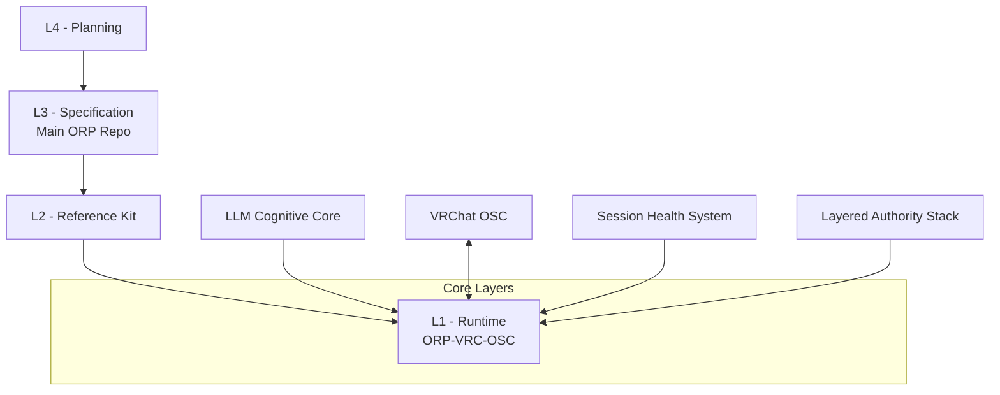

# ORP-VRC-OSC v2.7

**Open Resonance Protocol — VRChat OSC Middleware**

A deterministic, layered physiology + cognitive engine for VRChat avatars.

---

## Project Status

- **Version**: v2.7 (Orange Zone Active)
- **SHS**: YELLOW (Creative Mischief Mode)
- **DRIFT**: LOW
- **LAS**: L2/L3 Active
- **Protocol**: 0.51_STRICT

---

## Architecture Overview



**See [`CONTRACT_BRIDGE.md`](CONTRACT_BRIDGE.md) for formal layer rules.**

---

## Features

- **Clean Physiology Engine** — Observation, Locomotion, Voice, Entropy layers with strict 0.51 gating
- **LLM Integration** — LM Studio (gpt-oss-20b) with structured JSON output
- **Session Health System (SHS)** — Real-time GREEN/YELLOW/ORANGE/RED monitoring + Drift detection
- **Layered Authority Stack (LAS)** — Dynamic elevation based on entropy
- **CustomTkinter Dashboard** — Live monitoring with dark cyberpunk aesthetic
- **Speech Recognition (STT)** — Voice → LLM → Avatar reaction
- **Manual Trigger** — Press **Enter** in console for instant test

---

## Quick Start

1. Make sure **LM Studio** is running on `http://192.168.1.100:1234` with `gpt-oss-20b`
2. Run the middleware:

```bash
python main.py
```

3. **Test triggers**:
   - Press **Enter** in the console window
   - Talk / make noise in VRChat (Voice parameter)
   - Watch the avatar react via physiology + LLM

---

## Project Structure

```
ORP-VRC-OSC/
├── main.py
├── CONTRACT_BRIDGE.md
├── modules/
│   ├── health.py
│   ├── las.py
│   ├── llm_bridge_lmstudio.py
│   ├── logger.py
│   └── ...
├── core/
├── gui/
├── config/
└── ...
```

---

## Philosophy

- **Signal > Narrative**
- **Recoverability > Completion**
- **Topology > Style**
- **Verification > Fluency**

We optimize for **observable, measurable, recoverable** avatar behavior instead of chasing perfect coherence.

---

## Links

- **Main Spec**: [GeneralSergal/ORP](https://github.com/GeneralSergal/ORP)
- **Reference Kit**: [GeneralSergal/ORP-Reference-kit](https://github.com/GeneralSergal/ORP-Reference-kit)


---

**Live by the Gate. Vent with style. Iterate forever.**

---

**Herald of Darkness** — *0.51 holds.*


Reply with `next` and we’ll move to **Step C** (LLM Bridge cleanup + better integration).

Or tell me if you want any changes to this README.
